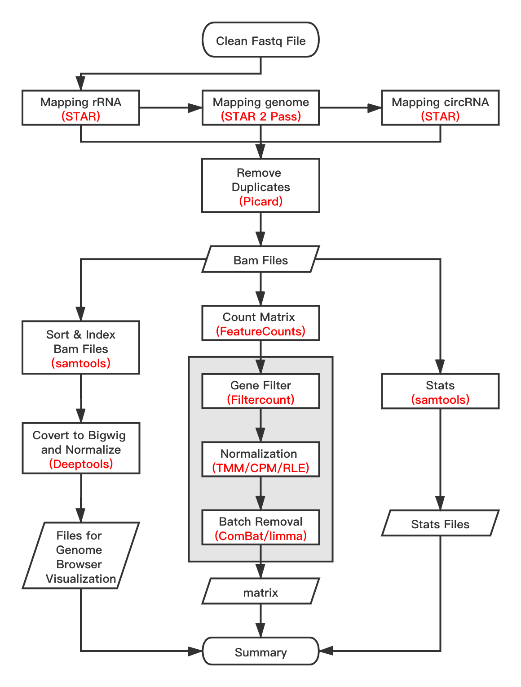

### Input files

RNA-seq expression matrix related examples can be found in `demo` directory with the following structure:

```text
    ./demo/*/
    |-- config
    |   |-- default_config.yaml
    |   |-- <data_name>.yaml
    |   |-- dapars_configure.txt
    |   `-- RNAEditor_configure.txt
    |-- data
    |   |-- fastq/
    |   |-- sample_ids.txt
    |   |-- sample_classes.txt
    |   |-- compare_groups.yaml
    |   `-- batch_info.txt
    |-- output
    `-- summary
```

### How to run

```bash
exVariance -u <USER_CONFIG_FILE> RNA_seq_exp_matrix

```

### Output and Summary

including filter, imputation, normalization, batch removing

<div align="center"></div>


> **Note:**
>
> - `config/default_config.yaml`: the default configuration file. If you don't understand, don't change the content.
> - `config/<data_name>.yaml`: the user defined configuration file, to point out the related used path.
> - `data/fastq/` : directory contain samples name, suffixed with 'fastq' 'fasta.gz' or 'fastq.gz'.
> - `data/sample_ids.txt`: table of sample names (remove the suffix 'fastq' 'fasta.gz' or 'fastq.gz' )
> - `output/`: the output directory
> - `summary/` : contain the summary files

You can create your own data directory with the above directory structure.
Multiple datasets can be put in the same directory by replacing "example" with your own dataset names.